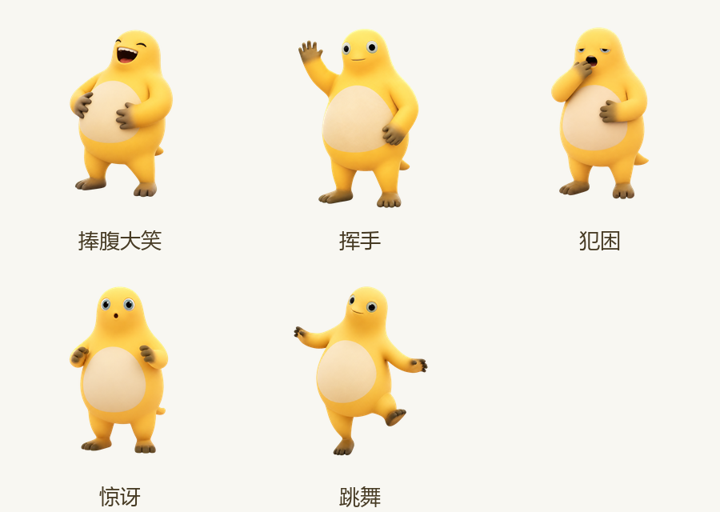

# 奶娃桌面宠物

一个支持 Windows、macOS 和 Linux 的 GIF 桌面宠物。支持透明背景、窗口置顶、拖、缩放、动画暂停和随机动作。

## 功能

- 透明无边框窗口，始终保持在桌面顶层
- 自动播放 97 帧奶娃 GIF 动画
- 左键拖动，滚轮缩放
- 双击暂停或继续，右键打开功能菜单
- 自动记住上次的位置和大小
- 通过边缘连通区域检测去除 GIF 白色及灰色背景
- 内置奶娃脸部多尺寸 Windows 应用图标
- 捧腹大笑、挥手、犯困、惊讶和跳舞五种扩展动作
- 随机状态机，也可通过右键菜单立即播放指定动作
- Qt 跨平台透明窗口，支持 Windows、macOS 和 Linux



## 使用

从 [Releases](../../releases) 下载 `NaiWaDesktopPet.exe`，双击即可运行。

也可以通过 Python 运行：

```bat
conda activate beijing
pip install -r requirements.txt
python desktop_pet_qt.py
```

## 构建 EXE

```bat
conda activate beijing
python build_cross_platform.py
```

构建结果位于 `dist` 目录。GitHub Actions 会在版本标签推送时自动生成 Windows、macOS 和 Linux 构建产物。

## 许可证

项目代码使用 [MIT License](LICENSE) 开源。请确保在再分发时拥有动画素材 `奶娃.gif` 的相应使用权。

扩展动作的角色比例、配色和表现形式参考了 MIT 开源项目
[timerring/codex-pet-naiwa](https://github.com/timerring/codex-pet-naiwa)，并为本项目重新制作；原“思考”GIF 保持不变。
